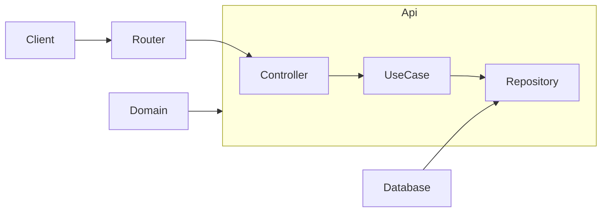
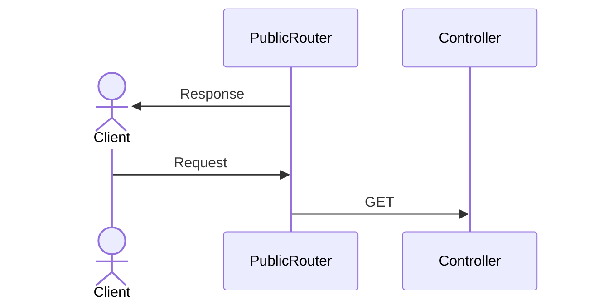
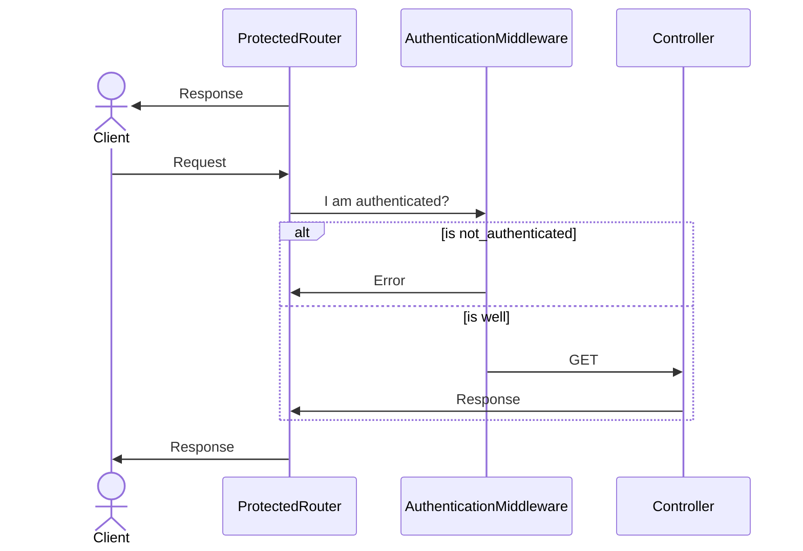

= TODO =

```mermaid
flowchart LR
    Client --> Router
    Router --> Controller
    subgraph Api
        Controller --> UseCase
        UseCase --> Repository
    end
    Database --> Repository
    Domain --> Api
```

```mermaid
sequenceDiagram
    create actor C as Client
    PublicRouter ->> C: Response
    C ->> PublicRouter: Request
    PublicRouter ->> Controller: GET
```

```mermaid
sequenceDiagram
    create actor C as Client
    ProtectedRouter ->> C: Response
    C ->> ProtectedRouter: Request
    ProtectedRouter ->> AuthenticationMiddleware: I am authenticated?
    alt is not_authenticated
        AuthenticationMiddleware->> ProtectedRouter: Error
    else is well
        AuthenticationMiddleware ->> Controller: GET
        Controller ->> ProtectedRouter: Response
    end
    ProtectedRouter ->> C: Response
```
